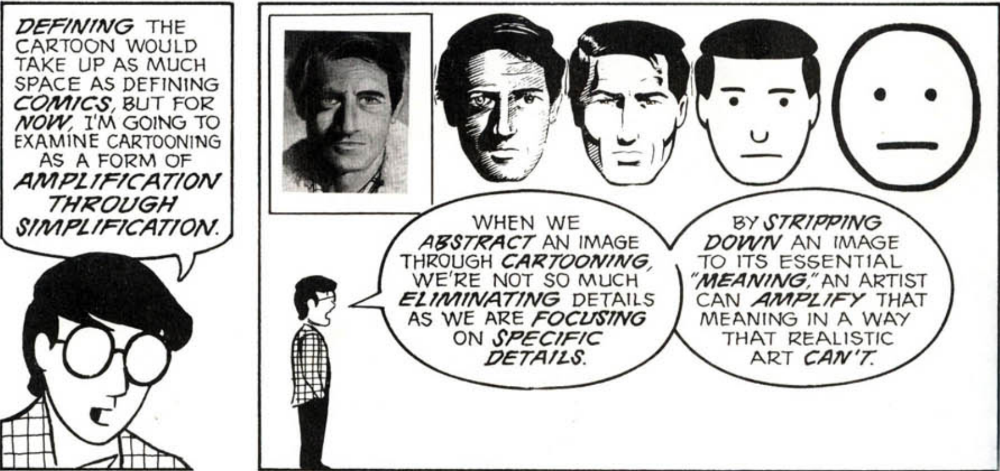
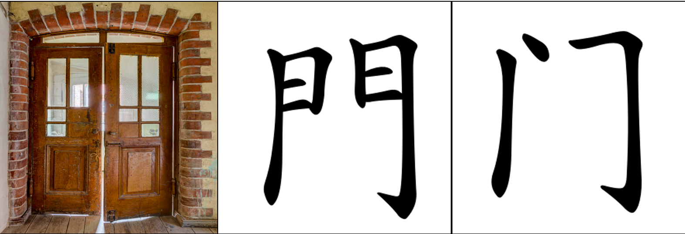
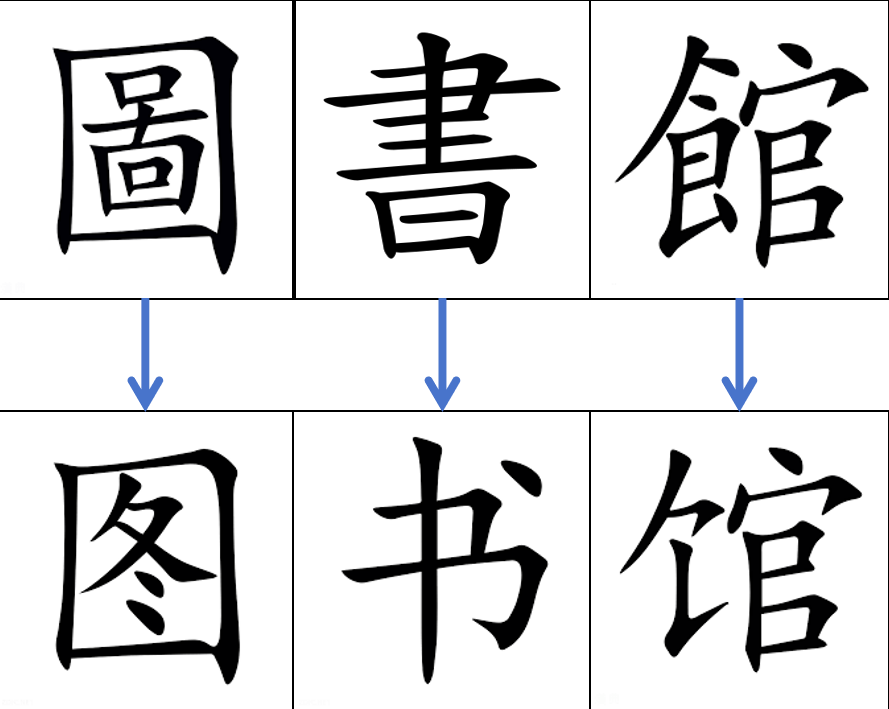

# VI(6). Design Principles for the New Universal Language

A universal language must be engineered, not inherited. It cannot rely on historical accidents, cultural traditions, or arbitrary phonetic conventions. Instead, it must be built on explicit design principles that ensure clarity, fairness, scalability, and compatibility with scientific and digital communication. The following subsections outline the foundational principles that guide the construction of this meaning-based, visually structured language.

---

## 1. Symbol Design: Iconicity, Visual Logic, and Compositionality

Every symbol must be designed with **semantic transparency** as a core requirement.  
This means:

- the symbol’s shape should reflect its meaning  
- related concepts should share visible structural elements  
- complex symbols should be constructed from simpler components  

This approach ensures that the writing system is:

- intuitive for beginners  
- scalable for advanced users  
- consistent across domains  
- resistant to ambiguity  

Iconicity does not mean literal pictograms; it means **structured visual logic** that mirrors conceptual relationships.

---

## 2. Mandatory Visual Connection to Meaning

A symbol must not be arbitrary.  
It must either:

- visually resemble the concept it represents, or  
- be composed of meaningful subcomponents that collectively express the concept.

This requirement prevents the emergence of opaque, phonetic-style vocabulary.  
It ensures that:

- new learners can infer meaning  
- advanced learners can decode unfamiliar terms  
- the system remains cognitively efficient  

This principle is essential for reducing the memorization burden that phonetic languages impose.

### Visual Abstraction and Structural Simplification

A meaning-based writing system must be designed so that each symbol has a **clear visual origin** and a **stable, globally identical final form**.  
The design process follows two key principles:

### 1. **Abstraction from real-world objects**  
   - A symbol may begin as a realistic depiction of an object, but it must be systematically abstracted into a simplified, stable silhouette that captures only the essential structural features.  
   - This ensures that the final symbol is easy to write, easy to recognize, and visually connected to its meaning.  
   - The traditional character **門** and its simplified form **门** illustrate this abstraction pathway: both originate from the visual structure of a physical door, progressively reduced to a compact, standardized form.

### 2. **Simplification of complex symbols before composition**  
   When a symbol already contains many radicals and must serve as the **base** for forming a **new composite symbol**, it may require a controlled simplification step.  
   
   This process is analogous to how the traditional form **圖書館** was simplified into **图书馆**: the essential semantic components are preserved, but unnecessary visual detail is removed to maintain clarity and prevent excessive complexity when **additional radicals** are added.  
   
   Such simplification ensures that composite symbols remain visually manageable and structurally coherent.

These principles apply **only during symbol design**, not during usage.  
Once a symbol is finalized, its form must remain **fully identical across all regions, eras, and contexts** to preserve global consistency.

Note that the Chinese characters used in these examples serve only as illustrations of abstraction and simplification principles. The universal language described in this whitepaper requires an entirely new, culturally neutral symbol system; it does **not** reuse or derive from existing scripts.

---

{ width=70% }

**Figure 1. The Abstraction Scale.**  
Adapted from McCloud, S. (1993). *Understanding Comics: The Invisible Art*. Tundra Publishing.  
This figure illustrates how a symbol is derived from a real object through progressive abstraction.  
The sequence demonstrates how non-essential visual details are removed while the core structural silhouette is preserved, resulting in a stable, simplified symbol suitable for universal use.

---

{ width=70% }

**Figure 2. Abstraction from Real Object to Stable Symbol.**  
This figure compares a real door, the traditional character **門**, and its simplified form **门**.  
It demonstrates how a symbol can be abstracted from a physical object into a compact, standardized form while preserving its essential structural logic.  
Photograph © Dietmar Rabich, Dülmen. Source: https://wuu.wikipedia.org/wiki/%E9%97%A8. Used under the terms of the license provided on the source page.

---

{ width=40% }

**Figure 3. Controlled Simplification of Complex Multi-Radical Symbols.**  
This figure shows how the traditional form **圖書館** is simplified into **图书馆**.  
It illustrates how a complex symbol can be reduced before being used as the base for new composite symbols, ensuring that added radicals do not create visual overload or structural ambiguity.

---

By grounding symbol design in controlled abstraction and principled simplification, the language ensures that every symbol remains meaningful, visually efficient, and globally identical.  
This prevents arbitrary drift and maintains long-term structural clarity.

---

## 3. Semantic Radicals and Category Markers

The language must include a set of **semantic radicals**—reusable components that mark conceptual categories.  
These radicals function similarly to:

- the “metal” radical in Chinese chemistry terms  
- the “fire” radical for heat-related concepts  
- the “water” radical for liquids  
- the “person” radical for human-related concepts  

Semantic radicals provide:

- immediate category recognition  
- internal consistency  
- efficient vocabulary expansion  
- intuitive learning pathways  

For example:

- all metals share a metal radical  
- all biological processes share a life radical  
- all physical forces share a dynamics radical  

This creates a coherent semantic architecture.

### A Worked Visual Example

To illustrate how semantic derivation and categorical precision operate in the proposed writing system, the following example uses a familiar Chinese character purely as a **logical demonstration**. The final language will not reuse existing scripts; all official symbols will be independently constructed from geometric primitives.

#### **1. Semantic Expansion from Core Attributes**

Consider the traditional character **“丁”**, used here only as an explanatory prototype.  
Its semantic evolution demonstrates how a single visual prototype can generate multiple meanings through logical extension:

- **Prototype attribute**: originally associated with the shape of a **nail (钉)**.  
- **Morphological derivation**: the flat, square‑like head of a nail leads to the meaning **“small cubes / diced pieces”**, as in:  
  - 肉丁 (*meat 丁*)  
  - 胡萝卜丁 (*carrot 丁*)  
- **Functional derivation**: the nail’s strength and supporting role lead to the meaning **“able‑bodied individual / productive member”**, as in:  
  - 男丁 (*male 丁*)

This example shows how semantic expansion can follow **logical, perceivable attributes**, not arbitrary convention.

#### **2. Radical‑Based Categorical Precision**

To prevent ambiguity, every derived meaning must be anchored by a **category radical** that specifies its semantic domain. Using the same prototype:

- **Biological domain**  
  `[person radical]` + **[丁]** → emphasizes human roles or demographic units  
  (e.g., 男丁 *male 丁*)

- **Shape / morphology domain**  
  `[shape radical]` + **[丁]** → emphasizes diced or cube‑like physical forms  
  (e.g., 肉丁 *meat 丁*, 胡萝卜丁 *carrot 丁*)

- **Material / tool domain**  
  `[metal radical]` + **[丁]** → emphasizes physical implements  
  (e.g., 钉 *nail*)

This mechanism ensures that semantic expansion remains **controlled, predictable, and logically classified**.

#### **3. Design Principles**

- **Not direct adoption**: the above examples illustrate semantic logic only; the final system will **not** reuse Chinese characters.  
- **Independent symbol construction**: all official symbols will be built from **geometric primitives and logical operators**, not inherited shapes.  
- **Meaning‑first architecture**: every symbol must encode its semantic domain and internal logic through its structure.

This example demonstrates how the system maintains semantic clarity while allowing flexible, logically grounded symbol creation.

---

## 4. STEM-Native Symbol Integration

The language must integrate seamlessly with scientific notation.  
This includes:

- mathematical operators  
- physical quantity symbols  
- chemical radicals  
- circuit diagram elements  
- vector and matrix notation  

Where existing symbols already encode meaning effectively, they should be retained.  
Where existing symbols rely on arbitrary letters (e.g., using “F” for force), they may be replaced with **meaning-bearing operators** that visually express the underlying concept.

This ensures that:

- scientific writing becomes more intuitive  
- terminology aligns with symbolic reasoning  
- learners do not need to memorize arbitrary letter assignments  

The goal is a unified symbolic ecosystem for both language and science.

---

## 5. Retaining Arabic Numerals and Useful Existing Scientific Symbols

Arabic numerals are:

- globally recognized  
- visually simple  
- semantically stable  
- culturally neutral  

They should remain unchanged.

Similarly, many scientific symbols (e.g., ∑, ∫, →, ≠, ∂) already function as universal meaning-based elements. These should be incorporated directly into the language rather than reinvented.

This preserves global continuity and reduces unnecessary learning overhead.

---

## 6. Replacing Arbitrary Letters with Meaning-Bearing Operators

Many scientific and mathematical concepts are currently represented by letters chosen for historical or linguistic reasons:

- “F” for force  
- “m” for mass  
- “E” for energy  
- “i” for current  
- “k” for constants  

These assignments are arbitrary and often confusing for learners, especially those without exposure to the underlying linguistic origins.

A universal language should replace such letters with **visual operators** that encode meaning directly.  
For example:

- a symbol representing “push/pull” could replace “F”  
- a symbol representing “quantity of matter” could replace “m”  
- a symbol representing “stored ability to cause change” could replace “E”

This reduces ambiguity and aligns scientific notation with the language’s semantic logic.

## 7 Semantic Evolution

### Scientific Logic Patching

A meaning‑based system can revise a symbol’s internal structure when scientific definitions change by replacing outdated radicals with more accurate ones.

For example:

**Whale reclassification**: When biology confirms that whales are mammals rather than fish, the symbol can be updated by substituting the **[fish]** radical with **[mammal]**, preserving recognizability while correcting the semantic structure.

**Gravity redefinition**: When physics reframes gravitation as curvature of time and space rather than a classical “force,” the symbol can be updated by replacing the **[force]** radical with a more precise conceptual marker, keeping the written form aligned with current theory.

These adjustments allow symbols to remain visually stable while evolving semantically with scientific progress.

### Global Version Management

Semantic updates are coordinated through a centralized, open, version‑controlled governance system. An international registry maintains the official radical set, reviews proposed changes, and distributes updates globally.

- **Patching**: Periodic updates correct outdated or inaccurate semantic structures.  
- **Pull Requests**: Researchers or users submit proposals for new symbols or revised radical configurations.  
- **Consensus**: Proposals are reviewed internationally and incorporated only after agreement on accuracy, necessity, and consistency.

This ensures that semantic evolution remains synchronized, scientifically grounded, and globally interoperable.

### Another Example: Domain‑Specific Semantic Differentiation (“Variable” Across Disciplines)

In natural languages, the same written word is often used to represent conceptually different ideas across disciplines. This is not a problem unique to English; Chinese also uses the same term “变量” regardless of whether the context is computer science or natural science. Although these concepts share the general notion of “something that can change,” their functional roles and cognitive categories are fundamentally different.

In computer science, a “variable” refers to an abstract symbolic container inside a program—an assignable placeholder that stores values and has no direct physical counterpart. In natural‑science fields such as biology, meteorology, or geology, a “variable” refers to a measurable quantity in the physical world, such as temperature, humidity, heart rate, soil moisture, or rock density. These two uses of the same term belong to different conceptual domains.

Natural languages often fail to visually distinguish these meanings. Learners must rely solely on context to infer the intended meaning, which increases cognitive load and makes cross‑disciplinary learning more error‑prone.

A meaning‑based writing system can address this structural limitation directly. By assigning different semantic radicals to different conceptual domains, the system should visually encode distinctions. For example, UMBL could use:

- a “symbol/code” radical for variables in computer science,  
- a “measurement/physical quantity” radical for variables in natural sciences.

---

## Summary of Section VI

This section establishes the structural foundations of a universal meaning‑based language.
Symbols must be visually logical, semantically transparent, and constructed through controlled abstraction and principled simplification. Semantic radicals provide categorical grounding and enable consistent compositional expansion. The system integrates naturally with scientific notation, retains universally recognized symbols, and replaces arbitrary alphabetic markers with meaning‑bearing operators.

The language also supports semantic evolution: symbols can be updated through radical‑level adjustments when scientific definitions change, and a global version‑controlled governance framework ensures that such updates remain synchronized, accurate, and internationally standardized. Together, these principles create a coherent, maintainable, and future‑aligned symbolic architecture suitable for global scientific communication.

